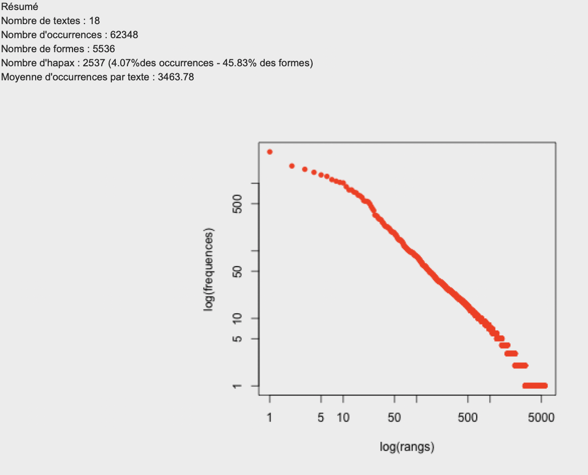

# Document explicatif et descriptif du projet

## Robur le conquérant de Jules Verne 

## Abdelmalek Firas - Master 2 DNHD - Université Bordeaux Montaigne

### Recherche des ressources et formatage du texte

Afin de pouvoir étudier l'ouvrage de Jules Verne «**Robur le conquérant**» il fallait récupérer une version textuelle modulable selon le besoin. Pour ce faire j'ai dû me servir de la version proposée par [wikisource](https://fr.wikisource.org/wiki/Robur_le_conqu%C3%A9rant) qui fourni le texte intégral en deux formats (TXT et PDF). J'ai aussi retrouvé d'autres ressources sur [gutenberg](http://www.gutenberg.org/ebooks/5126), notamment d'autres formats (EPUB et Kindle).

> Il faut dire qu'avoir la version textuelle au format txt m'a vraiment facilité la tâche car cela m'évite de chercher des solutions pour transformer des fichiers au format (pdf, epub, doc, etc.) en txt, qui suite à ce traitement pourront être suceptibles de contenir plusieurs fautes et/ou erreurs. 

Maintenant que j'ai en ma possession le fichier au format brut, je devais le remettre en forme selon les exigeances de l'outil iramuteq. Le fichier source en question était structuré mais je devais séparer les chapitres et surtout supprimer les textes qui ne sont pas en rapport direct avec l’œuvre et son contenu. Un nétoyage nécessaire pour une limitation du bruit et une meilleure analyse.

Cette ouevre comporte 18 chapitres que j'ai pris en considération pour réaliser le formatage en suivant la documentation d'Iramuteq. La synataxe est comme suit :

> **** *chapitre1

> **** *chapitre2

> ...

> **** *chapitre18

    **** : indique le point de départ et la nature du contenu du corpus, dans notre cas c'est un texte.
    * : indique la variable qui va définir les différentes parties du coprus.

Puis je l'ai sauvegardé sous le nom **Jules_Verne_Robur_le_conquérant.txt**. Il ne reste plus qu'à exploiter ce corpus dans l'outil iramuteq.

### Analyse du corpus

Une fois sur le logiciel et après avoir importer le texte j'ai obtenu ce tableau avec notamment des informations sur le nombre d'occurences et des parties présentent dans l'ensemble du texte :

On peut remarquer déjà depuis ce logarithme qu'il y une forte densitée de mots ayant peu d'occurrences, on peut en déduire donc que l'auteur a tendence à épuiser ces ressources de vocabulaire afin d'enrichir son oeuvre et peut-être attirer l'attention du lecteur en lui poussant à chercher le sens de ces mots. 

#### Nuage de mots

Pour commencer, j'ai réalisé une première analyse en nuage de mots afin d'avoir une représentation graphique des mots aux occurrences les plus élevées. Pour que cette représentation soir lisible et plus agréable, j'ai réduit le champs de visualisation à seulement les mots qui on une fréquence d'apparition plus que 20 fois.

Pour le coté analytique, je trouve que cette représentation n'est pas utile et peu pertinante si on cherche plus de sens et de profendeur.

#### Analyse de similitudes

En réduisant la taille de quelques facteurs et après multiples essais j'ai réussi à obtenir cette représentation de données plus ou moins lisible, qui expose 5 grand blocs qui s'intercectent entre-eux et qui tournent autour des personnages principaux de l'oeuvre avec la présence remarquable de quelques mots tel que "Prudent", "aeronef", "heure", "hélice", "appareil", etc.

#### classification Reinert et son AFC

Pour voir plus clair j'ai réalisé une classification Reinert qui nous permettra d'avoir des catégories selon une hiérarchie descendante.

#### Analyse factorielle des correspondances
